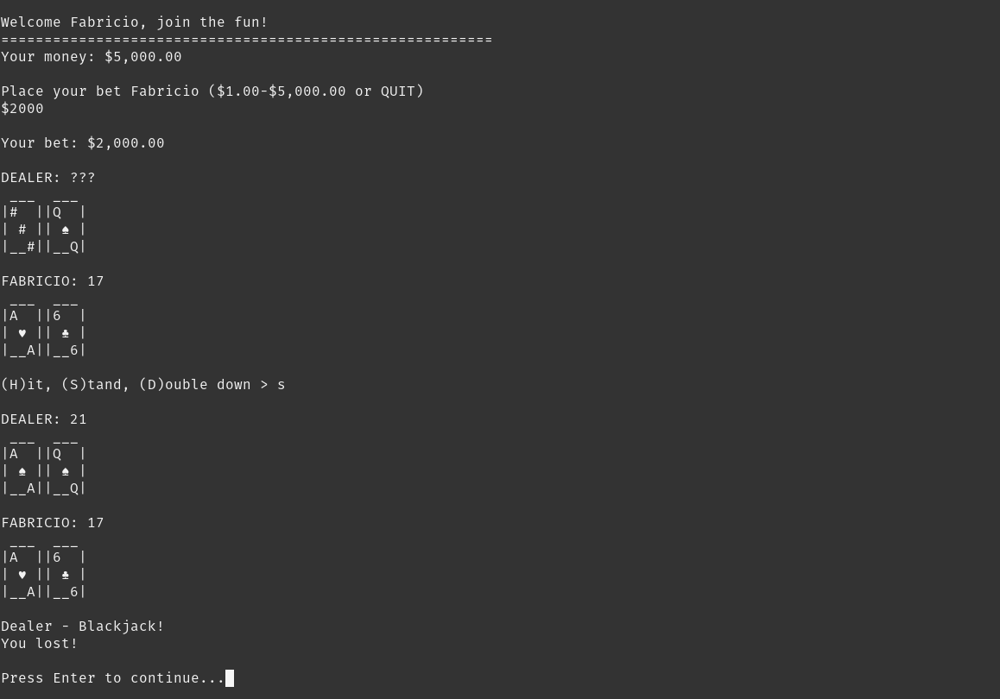

# Blackjack
🃏 A blackjack which has the same features as it normally contains

💵 By default, the player start with $5,000.00
## How it work?
- This blackjack work via terminal.
- To run the program just run the main class called ``main.py``

## Example

